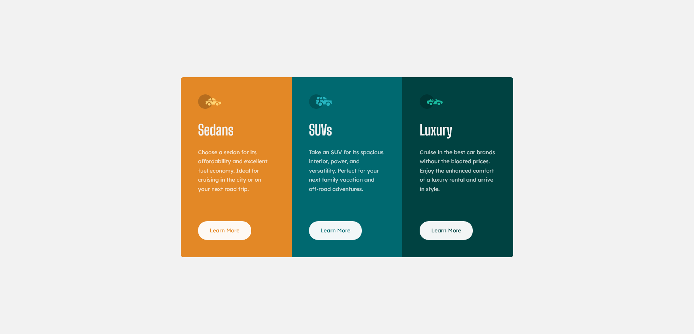

# Frontend Mentor - 3-column preview card component solution

This is a solution to the [3-column preview card component challenge on Frontend Mentor](https://www.frontendmentor.io/challenges/3column-preview-card-component-pH92eAR2-). Frontend Mentor challenges help you improve your coding skills by building realistic projects.

### Screenshot

### Links

- [Soulution](https://your-solution-url.com)
- [Live Site](https://your-live-site-url.com)

### Built with

- Semantic HTML5 markup
- CSS Custom Properties
- Grid
- Sass
- BEM Naming
- Media Queries
- Vite

### Info

- [Buttons with transparent text](https://codepen.io/KristinB/pen/WYrOQm)

## Author

- Frontend Mentor - [@bjoerndeppisch](https://www.frontendmentor.io/profile/bjoerndeppisch)
- Twitter - [@bjoerndeppisch](https://twitter.com/bjoerndeppisch)
